\newpage
\renewcommand\tablename{Tabla}

# 1 🌱 El per què d'usar Ecosia

Ecosia és un **motor de cerca** que utilitza els ingressos publicitaris per finançar la plantació d'arbres arreu del món. Funciona de manera similar a Google, però està fortament enfocat en la **sostenibilitat i la privacitat** dels usuaris.

## 1.1 Per raons mediamientals

L'aposta per la sostenibilitat i l'impacte positiu en el medi ambient d'este motor es pot detallar en els següents punts:

### Plantació d’arbres

- Ecosia destina els seus beneficis a la plantació d’arbres arreu del món. Aproximadament cada 45 cerques generen suficients ingressos per plantar un arbre.

### Ús d’energies renovables

-   Ecosia utilitza el 100% dels seus ingressos publicitaris per finançar projectes verds i sostenibles.
-   Els seus servidors funcionen amb energia renovable. Fins i tot produeixen més electricitat neta de la que consumeixen.

### Reducció de la petjada de carboni

-   Mentre Ecosia treballa activament per compensar les emissions de CO₂, Google, per exemple té una gran petjada de carboni.

## 1.2 Per raons ètiques

### Privadesa i protecció de dades personals o organitzacionals

-   No emmagatzema cerques de manera permanent.
-   No ven dades a anunciants ni utilitza eines de seguiment invasives.
-   Les búsquedes són encriptades per protegir la privadesa dels usuaris.

### Transparència financera

-   Ecosia publica informes mensuals sobre els seus ingressos i com es distribueixen els diners, cosa que ofereix més transparència que Google.

[Informes financers](https://ecosia.helpscoutdocs.com/article/402-reports-transparency)

### Suport a comunitats locals

-   Els projectes de reforestació d’Ecosia tenen un impacte directe en comunitats afectades per la desforestació, ajudant a crear llocs de treball i restaurar ecosistemes.

\newpage

# 2 🔧  Configuració en navegadors

Quan usem el buscador www.ecosia.org, el navegador usa el motor de búsqueda de ecosia idependentment del que tinguem configurat al navegador. Per a això establirem esta pàgina com la d'inici per defecte. 

Independentment, configurarem el motor d'Ecosia per defecte al navegador ecara que hem de saber que si usem www.google.com, s'usará el motor de de google no el d'ecosia.

## 2.1 Navegador Firefox

Entrem la configuració del navegador

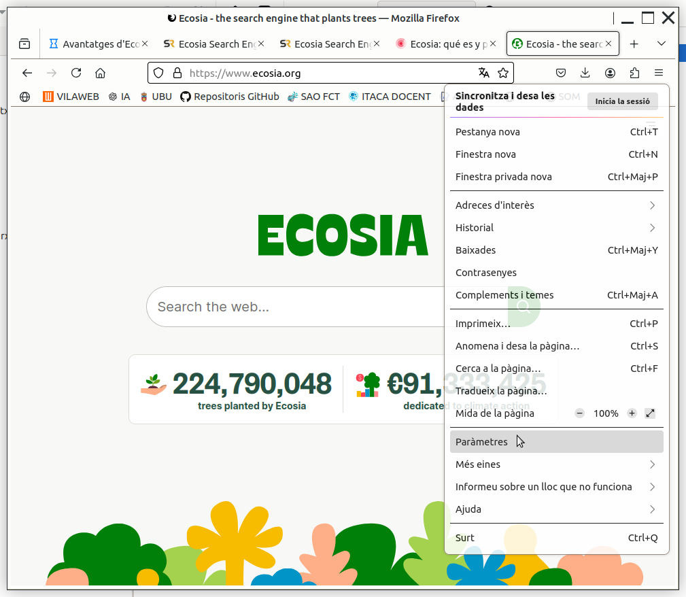

---

### Motor de cerca predeterminat

Una vegada estem en la configuració del navegador, busquem "motor" i seleccionem el que volem: ecosia.

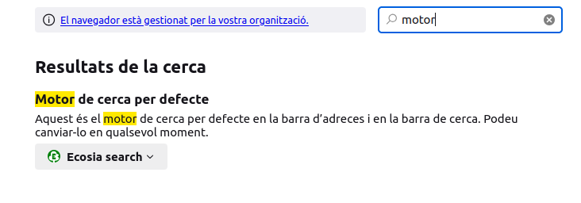

---

### Pàgina d'inici

Per fer ús del buscador còmodament, a banda del motor, podem canviar la pàgina d'inici predeterminada.

Des de l mateixa configuració ("paràmetres"), busquem "Inici" i escrivim la pàgina de ecosia.org

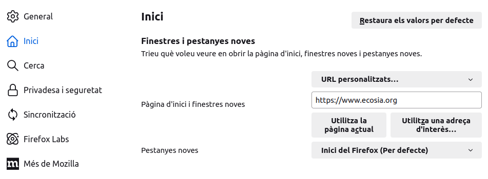

---

## 2.2 Navegador Chrome

Entrem la configuració del navegador 

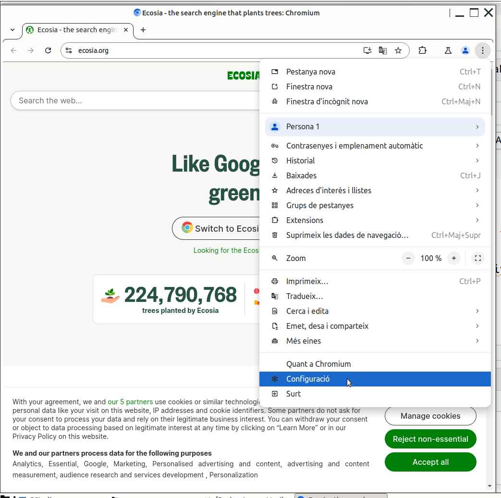

---

### Motor de cerca predeterminat

Una vegada estem en la configuració del navegador, busquem "motor" i seleccionem el que volem: ecosia.

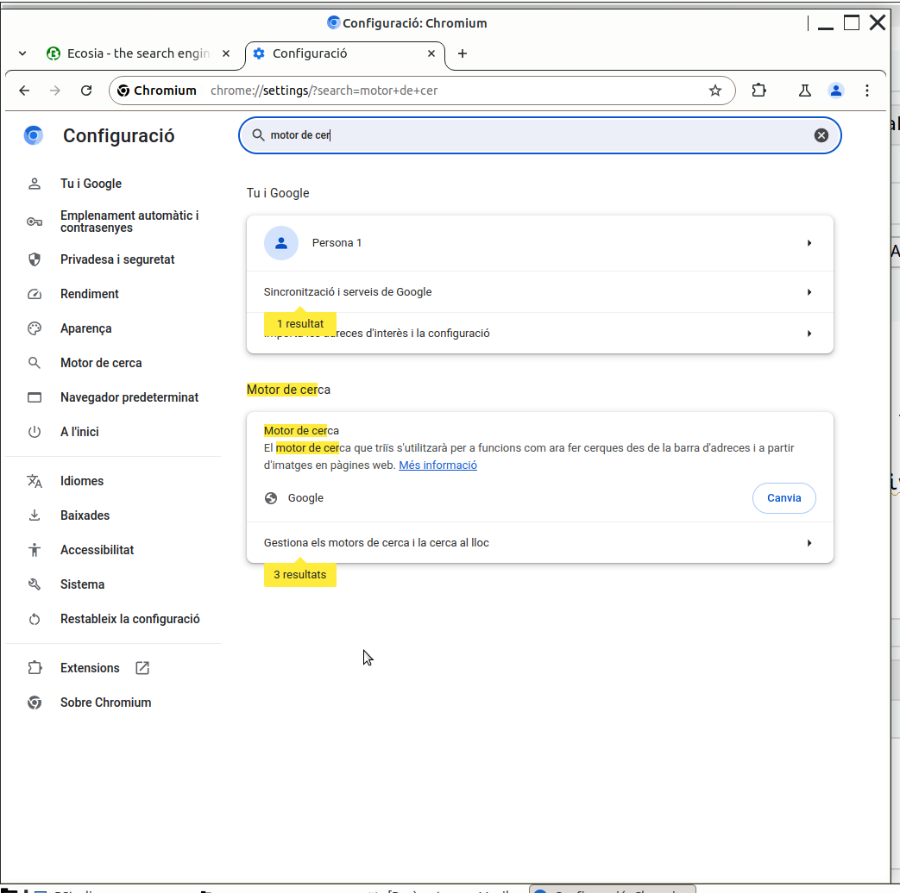

---

### Pàgina d'inici

Per fer ús del buscador còmodament, a banda del motor, podem canviar la pàgina d'inici predeterminada.

Des de l mateixa configuració, seleccionem "Inici" i escrivim la pàgina de ecosia.org

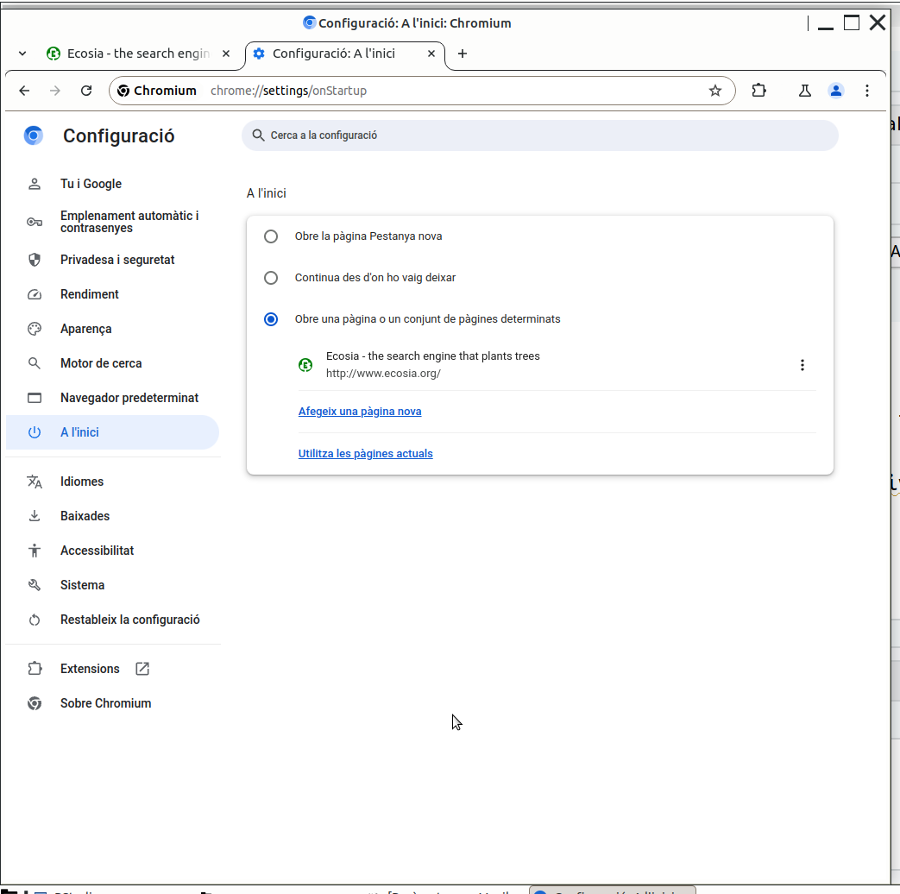

---

## 2.3 Navegador Edge (MS Windows)
 
Punxem en els **···** i seleccionem **Configuració**
 
 
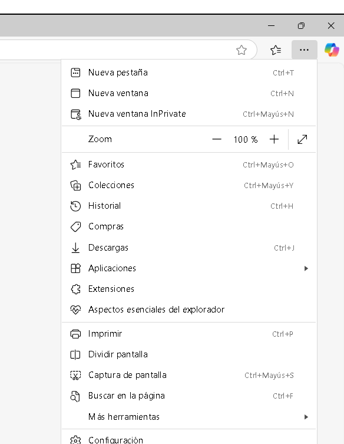

---

### Motor de cerca predeterminat
 

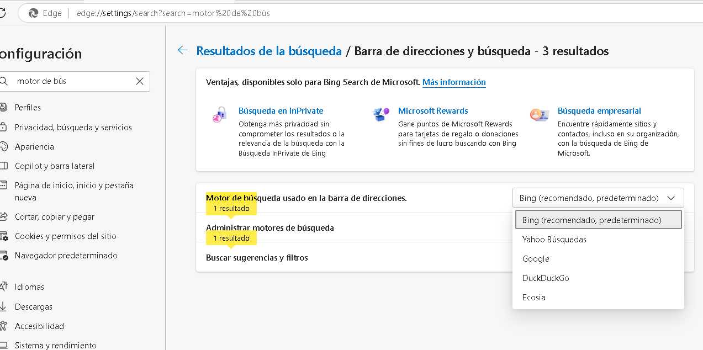

### Pàgina d'inici

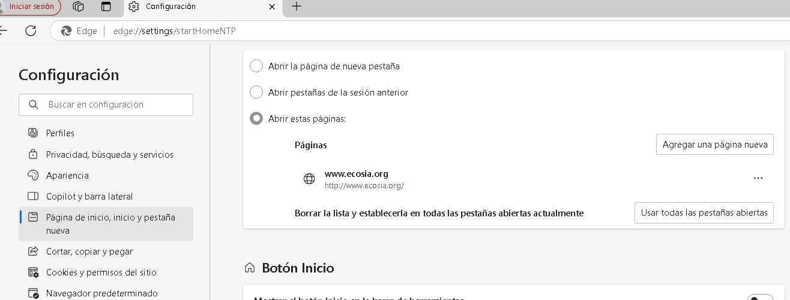

---

\newpage

# 3 🧩 Extensió d'Ecosia

La extensió **NO és necessària** per treballar amb Ecosia però ofereix: 

* Comptador d’arbres plantats.
* Configuració més ràpida i fàcil.
* Bloqueig de rastrejadors per més privacitat.

## 3.1 Extensions en Firefox

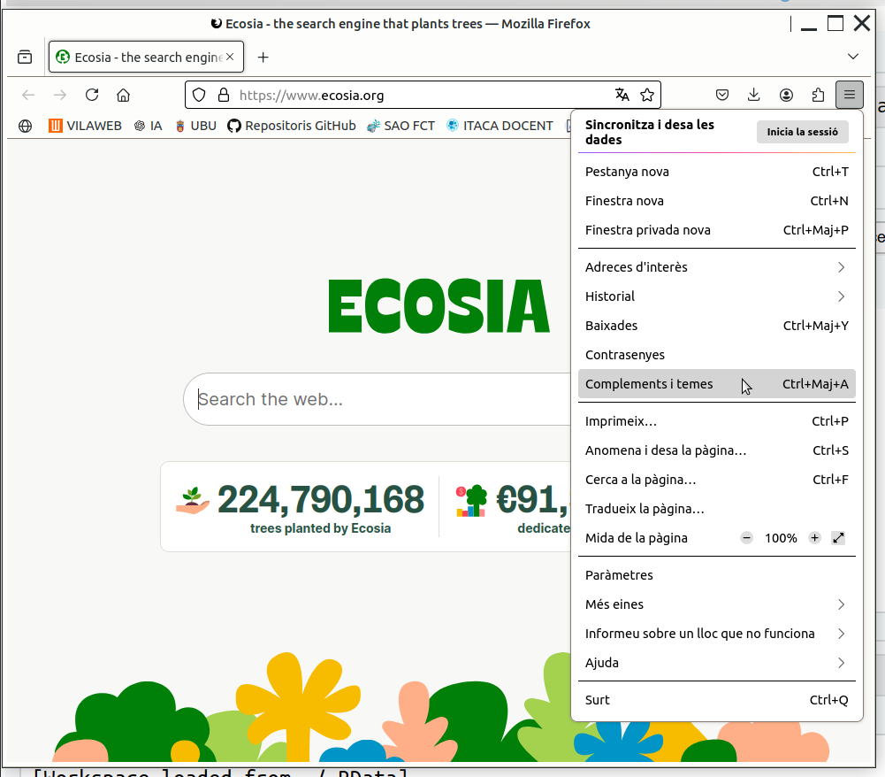

---

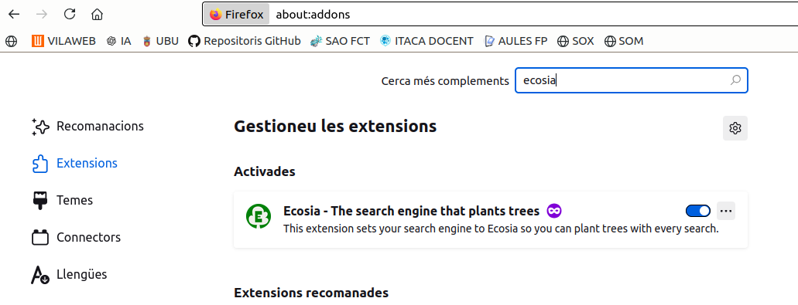

---

## 3.2 Extensions en Chrome

Entrem en **···** i seleccionem **Extensions**.

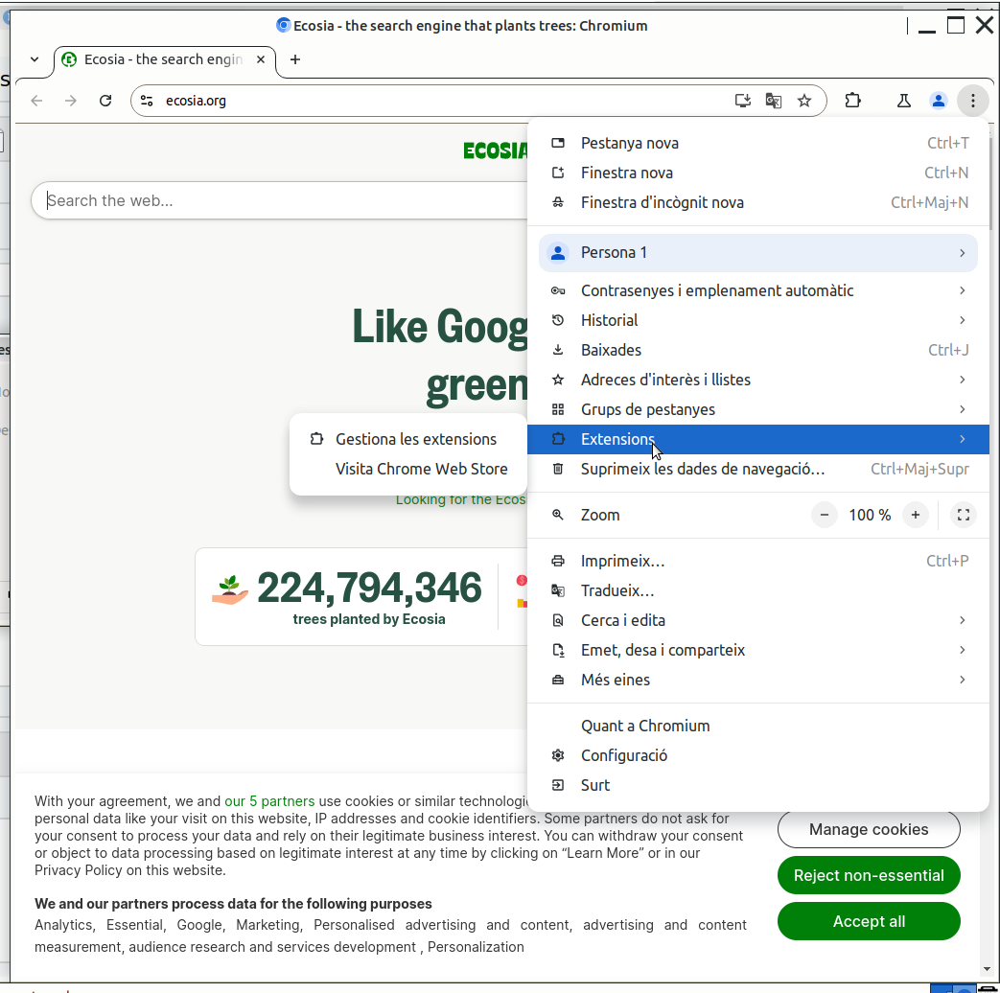

---

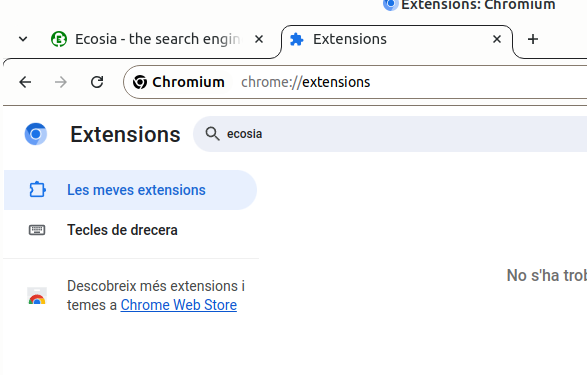

---

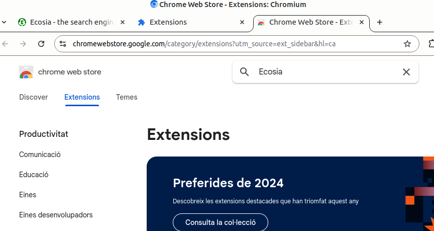

---

## 3.2 Extensions en Edge

Entrem en **···** i seleccionem **Configuración**. Després **Obtenir extensions per a MS Edge**

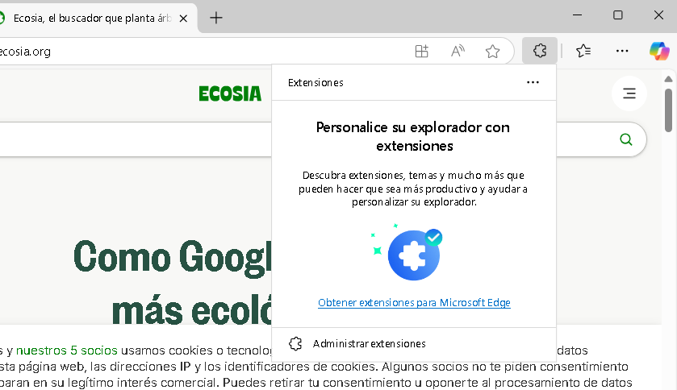

---

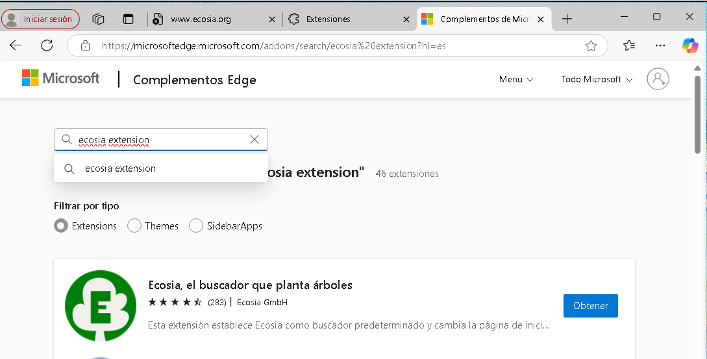

--- 

